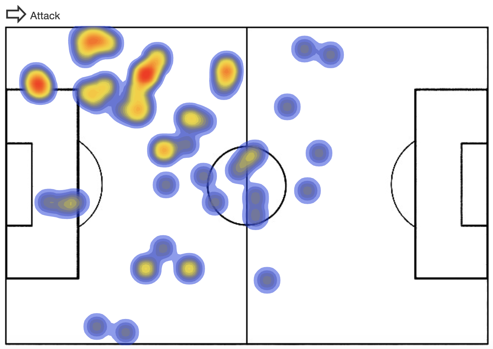

# [Football analytics](https://raedabr.github.io/Football-Analytics)

## Groupe

- Raed Abdennadher : raed.adbennadher@master.hes-so.ch
- Ludovic Gindre : ludovic.gindre@master.hes-so.ch
- Yoan Marti : yoan.marti@master.hes-so.ch

## Résumé du projet

### Public cible

Notre projet concerne tous les amateurs de football cherchant à mieux comprendre l'impacte de certains joueurs sur le jeu.

### Objectif

Nos buts premiers étaient :

- Mettre en lumière l'importance de certains postes clés dans le football moderne
- Donner plus d'importance aux joueurs n'ayant pas un rôle sur le devant de la scène.

### Source des données

Les données proviennent du site [StatsBomb](https://statsbomb.com/). Ils supportent activement la recherche dans le domaine du football. C'est pourquoi, ils s'engagent à partager publiquement de nouvelles données de manière régulière.

Les données des matchs de football étant leur principale source de revenu, l'accès aux données gratuites est limité et elles ne sont pas complètes. Ils ne publient pas une saison entière mais seulement quelques matchs. Lorsqu'un match est publié chaque événement du match est également publié. On ne peut pas accéder aux données des matchs en direct. En effet, ces données ne sont pas publiées en live sur leur API. Elles sont publiées sur leur [GitHub](https://github.com/statsbomb/open-data) et sont régulièrement mises à jour avec de nouvelles données. 

### Technologies utilisées

- [Bootstrap](https://getbootstrap.com/docs/3.4/)
- [d3.js](https://d3js.org/)
- [dc.js](http://dc-js.github.io/dc.js/docs/stock.html)

---

## Introduction

Le football est le sport le plus populaire au monde. il peut grandement impacter tout un peuple tant il est populaire. Pourtant, ce sport si adoré du grand public et tant pratiqué tout autour du globe, recèle toujours bien des secrets. Nous avons tenté de mieux comprendre les aspects tactiques et techniques de ce sport et ainsi mettre en lumière les éléments qui rendent une équipe meilleure qu'une autre.

Le plus souvent, les statistiques présentées lors des matchs sont relativement peu explicites. Ces statistiques, comme la possession des deux équipes, le nombre de tirs par équipe ou le pourcentage de passes réussies, permettent d'identifier qu'une équipe dans sa globalité est meilleure que l'autre. En revanche, elles ne présentent que les résultat de faits sans en connaître les causes. 

Nous avons cherché à apporter une nouvelles façon de voir le football. Notre principale critique des statistiques actuelles est qu'on ne distingue pas l'importance d'un joueur ou d'une association de deux joueurs complémentaires dans une équipe.

Notre intéret est de mieux comprendre l'influence déterminante qu'ont les milieux de terrain sur le jeu. En effet, peu de statistiques nous permettent de comparer objectivement deux milieux de terrains et ce pour plusieurs raisons majeurs. La première est que certains milieux ont des tâches plus défensives. Certains auront un rôle plus offensif. D'autres auront des rôles de lien entre l'attaque et la défense. Et pourtant tout ces joueurs aux profils très différents jouent au "même" poste. Les milieux plus offensifs auront alors des statistiques dites offensives plus élevées et des statistiques défensives moins élevées et vice-versa. Certains milieux entre eux peuvent alors être complémentaires et avoir une excellente entente sur le terrain ou au contraire empiêter sur les zones de son coéquipier.

Nous estimons qu'un bon milieu de terrain, quel que soit son rôle, influe grandement sur le niveau de jeu des ses coéquipiers en attaque ou en défense. Il aura alors une grosse activité sur le terrain et un grand nombre d'événements lui seront directement attribués. C'est pourquoi nous avons décidé de visualiser l'activité d'un joueur pendant un match. Nous souhaitons aussi pouvoir visualiser l'activité de plusieurs joueurs en même temps et pouvoirs comparer deux joueurs ou ensembles de joueurs ayant jouées les uns contre les autres.

Pour mieux comprendre le football, il faut d'abord connaître son fonctionnement et son organisation. Le football mondial est divisé en plusieurs compétitions auxquelles participent diverses équipes. Chaque occurence de d'une compétition a ensuite lieu à interval régulier, le plus souvent chaque saison.

L'une des spécificités du football est que les saisons n'ont pas lieu en même temps partout sur le globe. En Europe, une saison commence entre la fin du mois d'août et le début du mois de septembre et se termine entre la fin du mois de mai et le début du mois de juin de l'année suivante. Une saison européenne chevauche donc deux années. Par exemple, la saison en cours en Europe se terminera en 2020. On parle donc de la saison 2019/2020. En revanche, Aux états-unis les saisons commencent en mars et se terminent en décembre. La saison venant de se terminer était la saison 2019.

Une compétition est divisée en journées. Une journée voit chaque équipe de la compétition affronter une autre équipe. Elle se termine donc lorsque chaque équipe a affronté une autre équipe. Une journée d'une compétition peut durer plusieurs jours. Deux matchs d'une même journée peuvent être à une date différente.

Pendant un match toute une série d'événements ont lieu. Ils peuvent être de nature diverse. Un joueur fait une passe ou un tir au but, un gardien arrête un tir. Tous ces événements ont lieu dans des zones sur le terrain. Nous avons cherché à comprendre quelles étaient les zones d'influences des joueurs et quels sont les joueurs ayant le plus d'influence sur la victoire ou la défaite d'une équipe. Lors de chaque match, le site StatsBomb recueille tout ces événements en annotant la position de l'événement sur le terrain, le joueur concerné par l'événement et l'heure de l'événement.

## Conception

### Données utilisées

#### Evénements des matchs de football par StatsBomb

Les événements peuvent être de nature très différentes. nous avons décidé de les représenter sur une carte représentant un terrain de football. Pour la représentation, nous avons choisi d'encoder la densité des points dans une zone par une couleur évoluant du bleu au rouge. Nous pouvons ainsi afficher une heatmap d'un ou plusieurs joueurs. 

						*Heatmap de Xavi lors du match entre Barcelone et Valence le 4 mai 2008 (6 - 0 pour Barcelone)*

Les événements pouvant influer sur cette heatmap sont les suivants:

| Événement      | Description                                                  |
| -------------- | ------------------------------------------------------------ |
| Ball Receipt   | La réception ou la réception prévue d’une passe.             |
| Ball Recovery  | Tentative de récupération d'une balle perdue                 |
| Dispossessed   | Le joueur perd le ballon contre un adversaire parce qu'il a été tacklé par un défenseur sans tenter de dribbler. |
| Duel           | Un duel est un affrontement entre deux joueurs de deux camps opposés dans le match. |
| Block          | Blocage de la balle en se tenant sur son chemin.             |
| Offside        | Violation du hors-jeu. Cas résultant d'un tir ou d'un dégagement. |
| Clearance      | Action d'un joueur défensif pour écarter le danger sans intention de passer le ballon à un coéquipier. |
| Interception   | Empêcher la passe d'un adversaire d'atteindre ses coéquipiers en se plaçant  sur la trajectoire du ballon ou en réagissant pour l'intercepter. |
| Dribble        | Tentative d'un joueur de battre un adversaire                |
| Shot           | Tentative de marquer un but avec n'importe quelle partie (légale) du corps. |
| Pressure       | Faire pression sur un joueur adverse qui reçoit, transporte ou lâche le ballon. |
| Foul Won       | Une faute gagnée est définie comme le fait pour un joueur de gagner un coup franc ou un penalty pour son équipe après avoir été victime d'une faute commise par un joueur adverse. |
| Foul Committed | Toute infraction sanctionnée par un acte de faute de la part d'un arbitre. Les hors-jeu ne sont pas considérés comme une faute commise. |
| Bad Behaviour  | Lorsqu'un joueur reçoit un carton en raison d'une infraction en dehors du jeu. |
| Shield         | Le joueur protège le ballon qui sort des limites pour empêcher l'adversaire de le garder en jeu. |
| Pass           | Le ballon est passé entre les coéquipiers.                   |
| Miscontrol     | Le joueur perd le ballon à cause d'un mauvais toucher.       |
| Dribbled Past  | Le joueur est dribblé par un adversaire.                     |
| Carry          | Un joueur contrôle le ballon à ses pieds tout en se déplaçant ou en restant immobile. |

Il est important de noter que les déplacements des joueurs ne sont pas des événements. Ils ne constituent donc pas les heatmaps. Les zones blanches (sans événement) des heatmaps ne sont donc pas une absence du joueur dans la zone mais une absence d'événement.

## Application des concepts vus en cours

### Data-inc ratio
Afin de ne pas créer de conflit avec les heatmaps, nous avons décidé d'afficher un terrain blanc avec seulement les lignes du terrain représentées en noir. Ce n'était pas le cas au départ. Nous affichions un terrain en vert avec des lignes blanches. En plus d'être un frein à la consultation de notre outils par des personnes souffrant de daltonisme, le vert n'apportait aucune information. C'était donc du bruit inutile.
### Lois de Gestalt

Loi de région commune: Les heatmaps utilisent la proximité de 2 points pour les grouper et renforcer leur impact visuel.

### Daltonisme

Le simulateur [Coblis](http://www.color-blindness.com/coblis-color-blindness-simulator/) (*Color Blindness Simulator*) permet de visualiser une image telle qu'elle serait vue par une personne souffrant de daltonisme.

​					*Heatmap d'un joueur, vue par un daltonien souffrant de tritanopie (absence de bleu)*

Nous avons testé nos heatmaps et il ressort que notre palette de couleurs permet aux personnes souffrant de daltonisme de tout type d'utiliser notre outil.

## Conclusion

La représentation des heatmaps est un bon moyen pour visualiser l'activité des joueurs. On peut ainsi comprendre plusieurs aspects du rôle de milieu de terrain. Un bon exemple pour illustrer cet aspect est le match de Ngolo Kanté lors du match de la coupe du monde 2018 opposant la France et l'Argentine. Kanté avait pour rôle de tenir et museler le meilleur joueur de tout les temps, Lionel Messi. Il a adopter ce rôle avec une très grande application et la France a remporté ce match. L'activité de Ngolo Kanté sur ce match est impressionante Et elle suit a merveille celle de Lionel Messi.

​										*A gauche l'activité de Ngolo Kanté et à droite celle de Lionel Messi*

En revanche, lors de la finale de cette même coupe du monde 2018 Ngolo Kanté est malade. Voulant a tout prix jouer cette finale, aboutissement de tout les rêves d'un joueur de foot, il cache son mauvais état de santé au coach Didier Deschamps. La première mi-temps de ce dernier est si catastrophique et en deçà de ses prestations habituelles qu'il est sorti par le coach à la mi-temps. Nous pouvons alors constater que son activité, bien qu'il soit sorti à la mi-temps, est très faible et éparpillée.

Une autre observation que nous avons faite est que même si une équipe perds avec un gros score, prouvant ainsi de manière significative la suppriorité de l'équipe adverse, les milieux de terrains de l'équipe perdante auront une heatmap très fournie dans la zone de défense. Ceci est dû au fait que nous ne différentions pas les événements entre eux. Ainsi une passe, même ratée, un duel perdu ou encore se faire dribbler, sont des événement et seront donc représentés sur la heatmap. Cette méthode de représentation, bien que très explicite pour comprendre l'importance d'un joueur ou au contraire son absence lors d'une victoire, n'est pas suffisante pour comprendre quels ont étés les problèmes d'une équipe lorsqu'une supériorité si grande est constatée.

*Activité de Roberto Gayoso (Rayo Vallecano) lors de la défaite 6-0 contre le FC Barcelone lors de la saison 2013/14*

Sur cette heatmap on constate que Roberto Gayoso a eu une activité très bien répartie sur tout le terrain avec plusieurs points très chauds. Avec une telle activité on pourrait penser que la match fut très disputé alors que ce n'était pas le cas.

Malheureusement les données gratuites n'étant pas complètes, il est difficile de généraliser ces analyses à plusieurs matchs et à plusieurs équipes ayant différents styles de jeu. 

## Améliorations

En premier lieu, il serait bien de pouvoir accéder à plus de données. Dans le cadre de ce projet nous avons beaucoup utilisé les FC Barcelone parce que c'est l'équipe la plus représentée dans les données à notre disposition.

Ensuite, les heatmaps ne sont pas basée sur la même échelle. En effet, un point sur une heatmap composée de 100 événement aura plus de poids au niveau de la densité qu'une heatmap composée de 1000 événements. Ceci rend la comparaison entre deux heatmaps difficile à juger. Nous avons identifié ce problème trop tard et n'avons pas pu le résoudre.

Enfin une représentation pouvant accompagner les heatmaps pour représenter les données sous une autre forme pourrait aider compléter les analyses que nous souhaitons réaliser.
